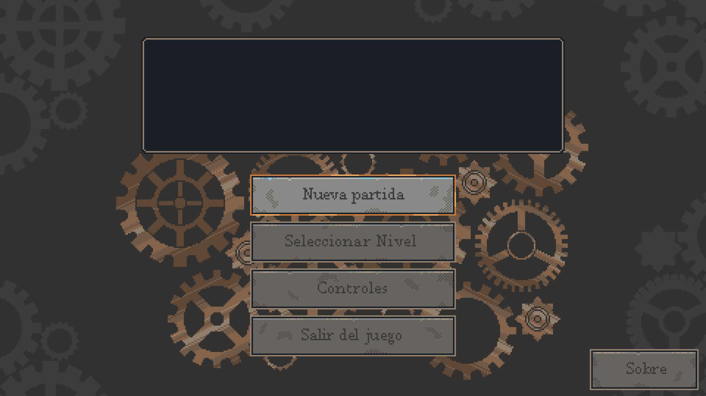
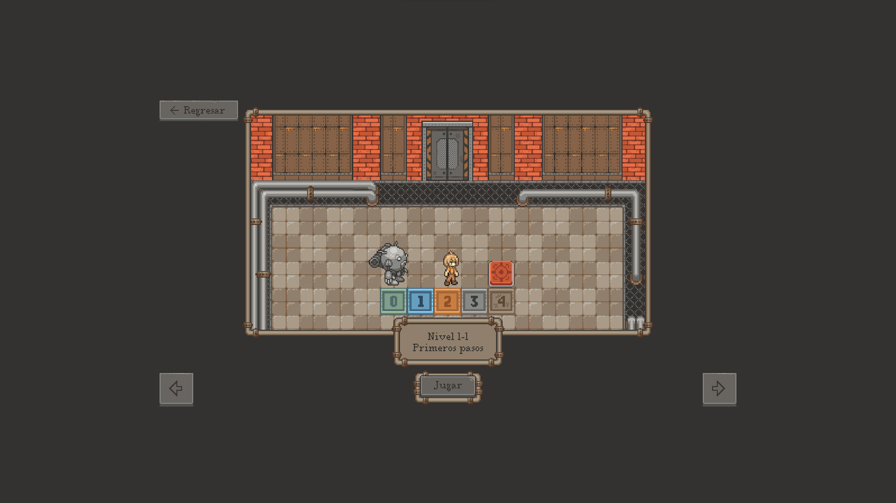
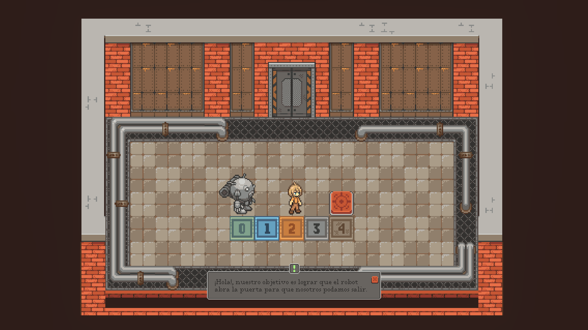
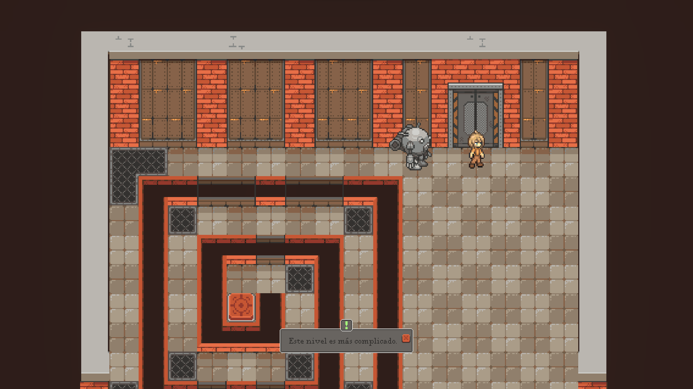
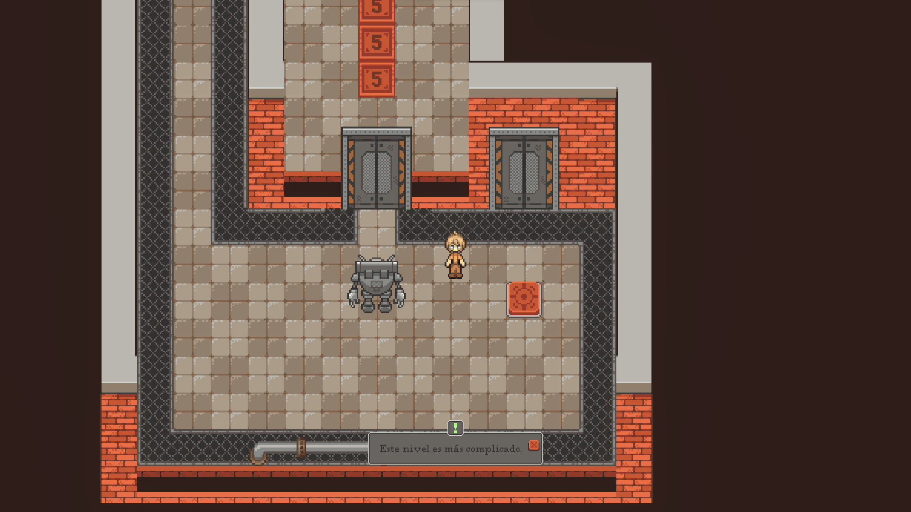
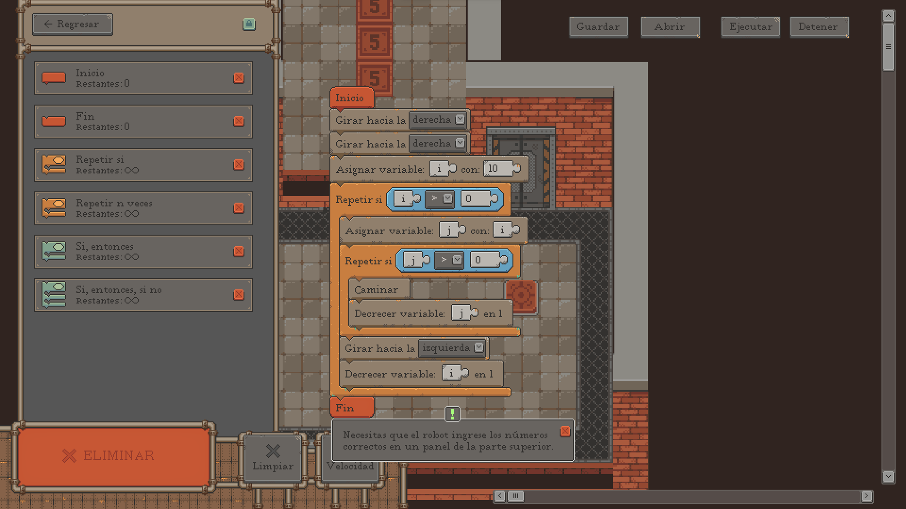
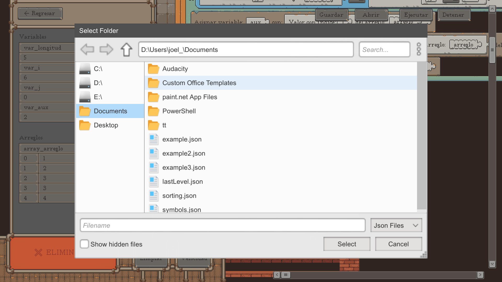

<h1 align="center">Scrap Coder</h1>

<b>Escuela Superior de Cómputo (ESCOM IPN) </b> | <b>Trabajo Terminal 2021-A026</b>

“Videojuego de Resolución de Desafíos a través de la Programación Visual para el Fomento del Desarrollo de la Lógica de Solución de Problemas (Scrap Coder)”

## Integrantes

-   [Joel Harim Hernández Javier](https://github.com/JoelHernandez343)
-   [Alberto Ehad García Barradas](https://github.com/Ehad46)

## Director

-   Dr. Yaxkin Flores Mendoza

## Descripción

Videojuego de resolución de desafíos o puzzles usando la programación visual como herramienta principal, con el objetivo de fomentar el desarrollo de la lógica de solución de problemas en los jugadores bajo el enfoque teórico de la gamificación y aprendizaje por TICs.

## Documentos relevantes

-   [Reporte técnico](./.github/docs/Reporte_Tecnico.pdf)
-   [Protocolo](./.github/docs/Protocolo.pdf)
-   [Presentación 1](./.github/docs/Presentacion_TT_1.pdf)
-   [Presentación 2](./.github/docs/Presentacion_TT_2.pdf)
-   [Artículo técnico](./.github/docs/Articulo_Tecnico.pdf)

## Capturas

